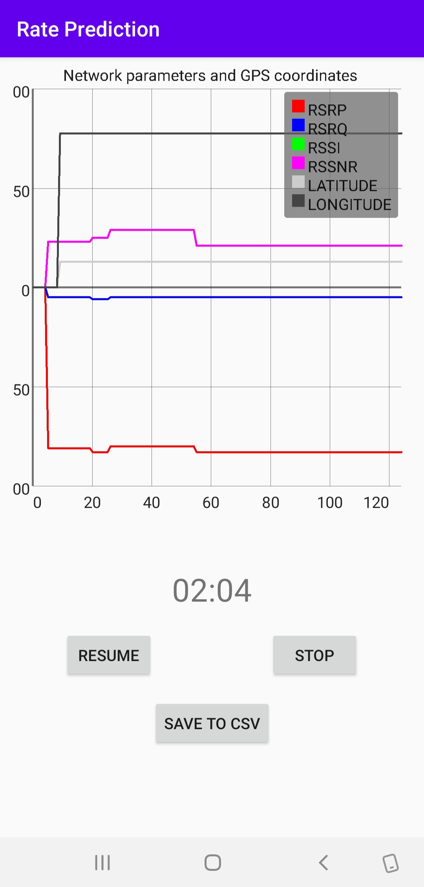

## RatePrediction

Android application to record Network parameters such as RSRP,RSRQ,RSSI, RSSNR along with GPS coordinates and save them in csv format to feed as input to Neural networks for predictions.

# Preview 

